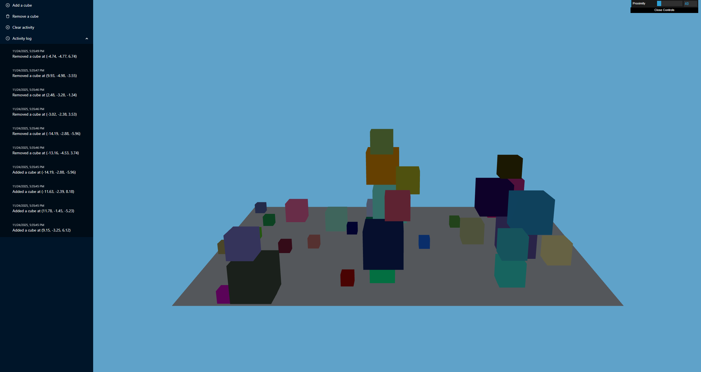

# simple-3D-scene-editor

A small React + three.js app that lets you add and remove cubes in a 3D scene, with an activity log and automatic scene persistence in `localStorage`.

## Features

- **Add random cubes**

  - Adds a cube with random size, color, and position on the ground plane
  - Uses simple AABB collision so cubes stack instead of intersecting

- **Remove cubes safely**

  - Removes a random cube that has no other cube on top of it

- **Activity log**

  - Records each action with:
    - Timestamp
    - Description including cube coordinates

- **Scene persistence**

  - All cubes (position, size, color) are serialized to `localStorage`
  - When you reload the page, the scene is restored as you left it

- **Camera controls (dat.gui)**
  - Simple GUI slider to adjust camera proximity

## Tech Stack

- **React**
- **TypeScript**
- **three.js** (3D)
- **Ant Design** (component UI library)
- **@emotion/css** (styling)
- **dat.gui** (camera controls)

## Getting Started

1. Install dependencies:

   ```bash
   npm install
   ```

2. Start the development server (depending on your setup, for example):

   ```
   npm run dev
   ```

3. Open the app in your browser (usually http://localhost:3000 or http://localhost:5173).


